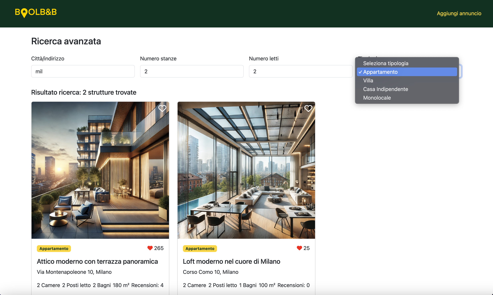
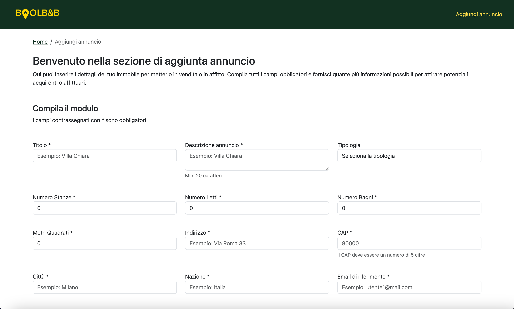
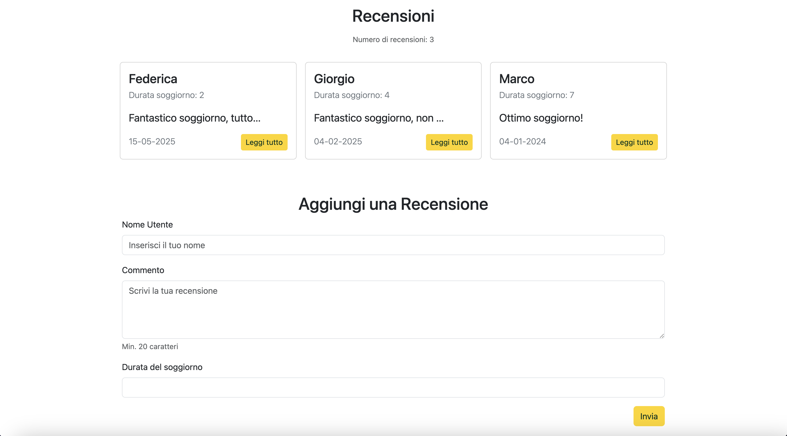

# BoolBnB WebApp


**BoolBnB** è una web app ispirata a **Airbnb**, sviluppata come progetto di team. L'app consente agli utenti di cercare, esplorare e pubblicare annunci di alloggi in modo semplice ed efficace. Il progetto adotta un'architettura **full-stack** con **React** e **JavaScript** per il frontend e **Express.js** per il backend, con un database **MySQL** per la gestione dei dati.

---
## Indice

- [Descrizione](#descrizione)
- [Tecnologie utilizzate](#tecnologie-utilizzate)
- [Funzionalità principali](#funzionalità-principali)
- [Screenshots](#screenshots)
- [Struttura del progetto](#struttura-del-progetto)
- [Installazione e uso](#installazione-e-uso)
- [Testing](#testing)
- [Workflow di sviluppo](#workflow-di-sviluppo)
- [Autori](#autori)

---
## Descrizione
BoolBnB è una web app full-stack ispirata ad Airbnb, che consente agli utenti di cercare, filtrare e pubblicare annunci di alloggi. Sviluppata con React per il frontend e Express.js per il backend, integra un database MySQL e API RESTful per la gestione dei dati. L’interfaccia è completamente responsive e offre funzionalità come like, recensioni, filtri avanzati e un modulo per contattare direttamente gli host.

## Tecnologie utilizzate

### Frontend
- React
- Bootstrap
- Responsive Design
- Ricerca e filtri dinamici

### Backend
- Express.js (Node.js)
- MySQL
- RESTful API

### Altre tecnologie e strumenti
- Gitflow workflow
- Collaborazione in team
- CRUD operations
- Multi-image storage
- Test con Mailtrap

## Funzionalità principali

- Visualizzazione annunci ordinati per numero di like
- Possibilità di aggiungere like agli alloggi preferiti
- Barra di ricerca per città/indirizzo con pagina di ricerca avanzata
- Filtri per:
  - Numero di stanze
  - Numero di letti
  - Tipologia di alloggio
- Pagina di dettaglio con:
  - Slider immagini
  - Info dettagliate
  - Recensioni con form per nuovi commenti
  - Modulo di contatto host
- Form dedicato alla creazione di nuovi annunci
- Interfaccia completamente responsive

---

## Screenshots

- Home Page


- Pagina di Ricerca Avanzata



- Create Page



- Sezione Recensioni 




## Struttura del progetto

```bash
boolbnb-webapp/
├── frontend/ # Interfaccia utente React
│ └── ...
├── backend/ # API e logica applicativa Express
│ └── ...
└── README.md
```

---

## Installazione e uso

### 1. Clona il repository

```bash
git clone https://github.com/federicascognamiglio/boolbnb-webapp.git
cd boolbnb-webapp
```

### 2. Configura il backend

```bash
cd backend
npm install
# Configura il file .env per connessione a MySQL
npm run migrate   # o uno script SQL/Migration tool
npm start
```

### 2. Configura il frontend

```bash
cd ../frontend
npm install
npm run dev
```

Il frontend sarà disponibile su http://localhost:3000 (o la porta configurata).

## Testing

```bash
# Backend
cd backend
npm run test

# Frontend
cd ../frontend
npm run test
```

## Autori
Progetto sviluppato in team:

- Federica Scognamiglio
- Nicolò Di Domenico
- Marco Amantea
- Yufei Chang
- Vincenzo Bozzanca
